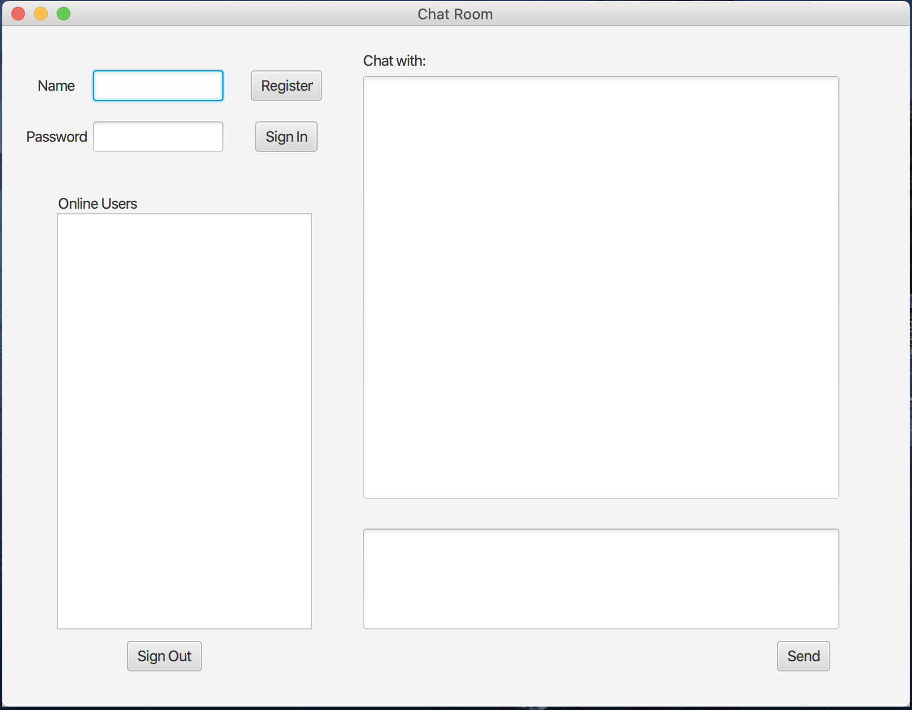

##Abstract 

This report outlines the design and development of a program which is a client-server chat program. The program was written in JAVA and tested on MacOs. The design and program are modular in nature and make maximum use of abstract data types and of software re-use. Particular attention is paid to design a server part to receive multiple clients requests and a client part with GUI can send request to server. The report includes a the test cases used to verify the correct operation of the program, as well as the entire code. 


## Contents Page 

 [TOC]


## Project Description

In this project, a server part which can handle multiple clients and a client part with a simple GUI are developed. The server part can handle different requests from clients such as register, sign in and send message to someone. The client part can correctly connect with the server and ask several requests. Besides, after the user sign in their account, they can see the online users and chat with them. Next, we will talk about the details of this program and show some test results.


## Detailed Design

This section should describe your overall design approach and the structure of your code, with emphasis on the more complicated portions of your design and code.

**Server**:

The server part is started by creating a serversocket with a local port. It contains a userMap which is used for storing the registered usernames and passwords and a socketList which is used for storing the running client socket. Then it will listen the coming client and for each of them create a new thread to handle the client request. Here, I design four different commands for the user, they are:

```bash
1. register <username> <password>
2. signin <username> <password>
3. signout
4. sendto <message> <username>
```

When received register command. If the username does't exist in userMap, then server will add this user information into userMap. If the username already exist, it will warn the user. 

When received signin command, server will compare the username and password with the userMap. If it is correct, then server will create a socket and a thread for this user.  Then this new thread will check socketList who are online now and send the online user list back to user. At the same time other online user will receive the notification of this user's online status. Then this socket and thread will keep listening until the user sign out.

When received signout command, server will close the connection between this user. It will close this socket and thread.

When received sendto command, server will check if the user online or not. If it offline, server will warn the user. On the contrast, server will send the message to the target user.


**Client**:

For the client part, I design a login GUI, a chat room GUI for the user and a client class. The client class contains an online user list which will record who are online now. The login window is shown as Figure 1. Here we can input the Server IP and port number to connect a server. After we click the connect button, client will open a new socket connect with Server.

<center>        <br>    <div style="color:orange; border-bottom: 1px solid #d9d9d9;    display: inline-block;    color: #999;    padding: 2px;">Figure 1</div> </center>

If we successfully connect to the server we will get to the chat room page. The chat room GUI design is shown as Figure 2. In this GUI, it contains four buttons. Each one will send the exactly command to server. 	

<center>        <br>    <div style="color:orange; border-bottom: 1px solid #d9d9d9;    display: inline-block;    color: #999;    padding: 2px;">Figure 2</div> </center>

After we fill out the Name textfield and Password textfield.

When we click the register button, client will try to register a new user in server. Then here will appear a server log to notify the users whether they succeed or not.

When we click the sign in button, client will log in the user. Server will also tell them if they succeed or not. Then client will open a new thread  keep listening the output streams from server until we sign out. At the same time,  In the Online Users list view of GUI, it will appear the users who are online now. 

When we click the sign out button, the client program will terminate, and the socket and thread will be closed.

Then we can choose the online user to talk with. After choose the user and fill out the text input area, we can click the send button. The target user will receive our message at the same time.


## 